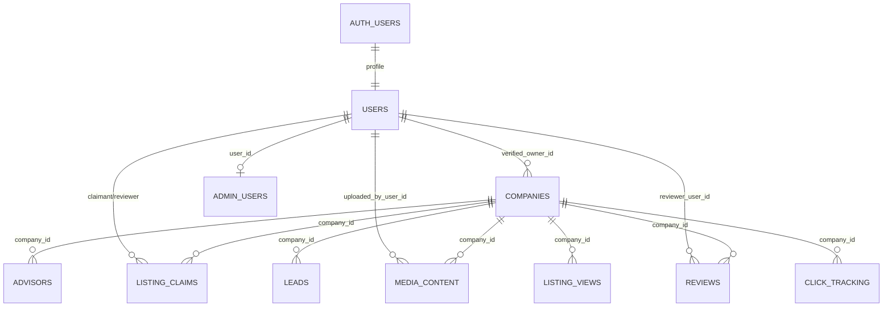

# Target Company-Centric Data Model

**Status:** Contract for later implementation
**Production changes made:** None

## Core contract

1. `companies` are businesses and directory listings.
2. `advisors` are individual people associated with a company through `advisors.company_id`.
3. A column named `advisor_id` always references an individual in `advisors`. It must never carry a company/listing ID.
4. Company-targeted relationships use `company_id`. User-targeted relationships use an explicit user column such as `claimant_user_id`, `reviewer_user_id`, `uploaded_by_user_id`, or `admin_user_id`.
5. Claims, reviews, leads, listing analytics, ownership, pricing, subscriptions, verification, and listing media target companies unless a documented feature genuinely targets a person.
6. Normal user authorization is enforced by RLS with the authenticated user's identity. The service-role key is reserved for controlled server administration and must not be required for owner, reviewer, claimant, or ordinary authenticated workflows.
7. Existing production names are retained where they express the correct entity and avoid unnecessary data movement.

## Canonical relationships

## Entity contracts

### `companies`

Retain the production table and IDs. It owns listing identity (`name`, `slug`), business contact/location, search, verification/ownership, media, pricing, subscription state, publishing state, rating aggregates, and other listing-level product fields approved later.

- `verified_owner_id -> public.users(id)` remains the single current owner unless multi-owner access becomes a product requirement.
- `verified` describes business verification. It is not a substitute for ownership; owner access is based on `verified_owner_id`.
- `verification_date` records verification completion.
- Future listing status should use an explicit constrained value such as `publication_status`, rather than recreating several loosely coupled booleans.
- `updated_at` must be maintained consistently by the shared timestamp trigger.
- The existing 202 company IDs are stable identifiers and must not be remapped to advisor-person IDs.

### `advisors`

Retain the production table as the people/team table. Each row belongs to exactly one company and cascades when that company is deliberately deleted.

- Person fields include name, title, bio, specialties, experience, background, certifications, contact details, image, display order, and active state.
- Company owners manage advisors through the owning company relationship.
- The legacy `advisor_team_members` table is not part of the target model; its application routes move to `advisors`.
- Business fields from the legacy `AdvisorProfile` type do not migrate onto people merely because the legacy table shared the name `advisors`.

### `users`

Retain `public.users` as the application profile keyed to `auth.users`. It is the canonical FK target for application relationships. Needed public-display or author fields may be added here after a privacy review, or exposed through a deliberately scoped view.

`users_public` is not created as an unexplained duplicate. Existing code must move to `users` or a named safe view. Email remains in `auth.users` unless a product requirement justifies duplication.

### `listing_claims`

Retain the production table and its company target.

- `company_id -> companies.id`.
- `claimant_user_id -> users.id` and must equal `auth.uid()` for self-service insert/read/update.
- `reviewed_by -> users.id` is the administrator who decided the claim.
- `claim_status` is the canonical status name and production enum.
- `verification_method` and `verification_data` hold the verification mechanism and non-secret structured evidence. Raw credentials, tokens, and unnecessary PII must not be stored.
- The one-active-claim-per-company invariant remains.
- Approval must atomically update the claim and set the company's `verified_owner_id`, `verified`, and `verification_date` after verifying the company is not owned by another user.
- The legacy `advisor_id`, generic `status`, `claimant_email`, and redundant `auth_user_id` contract is rejected.

The existing application email-token/password-creation flow needs a product/security decision. The preferred model is authentication before claim submission, which makes `claimant_user_id` authoritative and avoids custom password creation through a claim endpoint. If pre-authentication claims remain required, they need a separate, expiring, hashed challenge model and a deliberate nullable-claimant transition; that is not assumed here.

### `media_content`

Retain production as company media metadata.

- Rename or interpret uploader consistently as `uploaded_by_user_id`; a future rename should be non-breaking and reviewed.
- Storage provider choice is independent of entity ownership. Cloudinary or Supabase Storage may hold bytes, while this table holds approved metadata.
- Owner write and approved public-read RLS semantics remain. Administrator moderation must be explicit.

### `reviews`

Create only after the feature contract is approved. Because production has no table or rows, use unambiguous names from the start:

- `company_id -> companies.id ON DELETE CASCADE`.
- `reviewer_user_id -> users.id ON DELETE CASCADE`.
- Unique `(company_id, reviewer_user_id)` unless multiple reviews over time are a product requirement.
- Rating check 1–5; content, published/moderation state, verification state, owner reply metadata, and timestamps.
- Public users read published reviews; authenticated users create/update/delete only their own review; company owners may reply but not alter the reviewer's rating/content; administrators moderate through an explicit admin predicate.

Any company rating aggregate must be maintained on `companies`, not `advisors`.

### `leads`

Create with `company_id`, not `advisor_id`. Lead contact fields require a retention and privacy policy. Public/anon creation should include abuse controls; company owners may read/update only leads for their companies; administrators may access through explicit authorization. Do not store raw IP addresses when a keyed, rotating hash or rate-limit service is sufficient.

### `listing_views` and `click_tracking`

Both target `company_id`. If retained as raw event tables, define minimal event metadata, retention, indexes, and insert-only public policies. Owner reads are scoped through company ownership. Administrators use explicit authorization. `clicked_url` should become a constrained event target/category rather than arbitrary sensitive URL data where practical.

No application path currently writes `listing_views`; the implementation step must either add the deliberate insert path or remove dashboard expectations.

### `admin_users`

Create as a minimal authorization mapping from `user_id -> users.id` (or `auth.users.id` if the profile is not guaranteed), with active state and audit timestamps. Avoid storing a duplicate email unless it is demonstrably needed.

RLS policies must not recursively query the protected table in a way that triggers infinite recursion. Use a reviewed authorization predicate, such as a tightly scoped `SECURITY DEFINER` function owned by a non-login role with a fixed `search_path`, execute grants limited to intended roles, and tests proving non-admin denial. Bootstrap is a controlled, audited one-time operation; documentation must not recommend disabling RLS in production.

### Optional objects

- `notifications`: user-targeted; optional `company_id` for context. No ambiguous `advisor_id`.
- Blog tables: separate bounded subsystem. `related_company_id` links a post to a listing. Do not block core directory reconciliation on the blog decision.
- `csv_import_logs`: operational audit object with retention and administrator-only access. Imported listings are companies.

## Ownership and authorization matrix

| Actor | Companies | Advisors (people) | Claims | Media | Reviews | Leads/analytics | Admin data |
|---|---|---|---|---|---|---|---|
| `anon` | read public listings | read active people | none by default | read approved | read published; optional controlled insert is not preferred | controlled insert only | none |
| authenticated user | public read | public read | create/read/update own pending claim | none unless owner | own review CRUD | create lead | none |
| verified company owner | update owned company | CRUD people for owned company | read relevant final state if required | CRUD owned-company media | reply for owned company | read/update owned-company leads; read analytics | none |
| administrator | explicit moderated access | explicit moderated access | review/decide | moderate | moderate | operational access | manage via audited path |
| service role | exceptional server operations | exceptional | exceptional | exceptional | exceptional | exceptional | bootstrap/maintenance only |

RLS tests must use the actual `anon` and `authenticated` database roles and JWT identity context. Testing solely with the service-role client proves nothing about user authorization.

## Naming and foreign-key rules

- Foreign-key columns include their entity: `company_id`, `advisor_id`, `reviewer_user_id`, `claimant_user_id`.
- API parameters and component props follow the same rule. A `company.id` must never be passed under a prop named `advisorId`.
- Supabase relationship selections use the real FK name and target (`companies(...)`, not `advisors(...)` for listings).
- Generated database types are authoritative for row/insert/update shapes. UI types are composed separately and may not silently redefine database entities.
- Compatibility aliases that perpetuate ambiguous IDs are prohibited. If a transition endpoint accepts an old client payload temporarily, it must validate and translate to `company_id` at the boundary and have a removal date.

## Retained production choices and required decisions

Retain now: five production tables, five production enums, current company/advisor IDs, company-centric FKs, the shared timestamp function, the 10 existing policy semantics as the initial floor, PostGIS geography on companies, and object names that already express the target model.

Decide before later migrations: review moderation fields; lead retention; analytics retention/model; company pricing/subscription fields; pre-auth versus authenticated claims; public display profile fields; blog scope; notifications; media byte provider; multi-owner support; and administrator bootstrap/governance.

These decisions may add fields or tables, but none may reverse the company/advisor identity contract.
